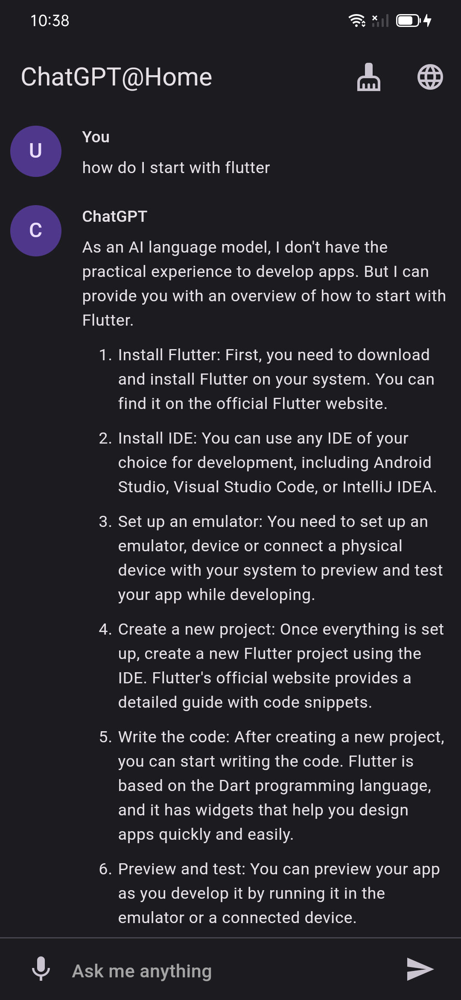

# :robot: ChatGPT@Home

Yet another ChatGPT clone in Flutter, now for the phones. (WIP)

- Material 3
- Render results in Markdown
- Dictate in any device-supported language (one at a time)
- Self-service (put in your own API key)



## Prepopulating the API key

By default, the app will request the user to input an OpenAI API key. However, you can prepopulate it by
filling out `define.json.template` and pass it to Flutter commands:

```shell
flutter run --dart-define-from-file define.json
```

Please note that this is not secure and will store your API key in plain text within the app's binary.